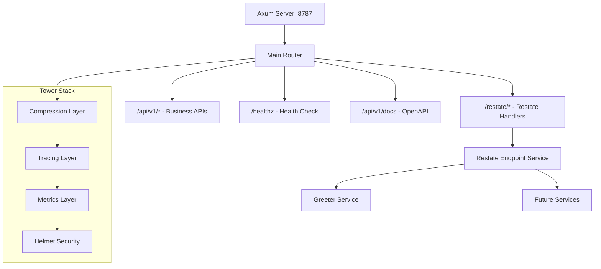
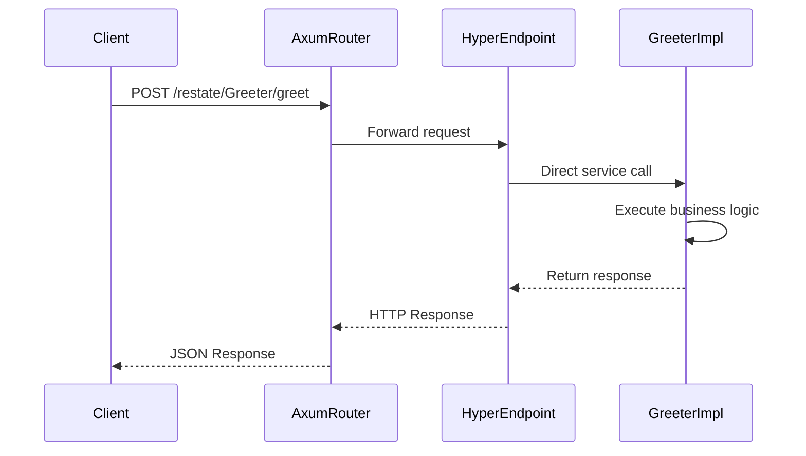

# Restate-Axum Integration Design

## Overview

This design outlines the integration of Restate SDK handlers directly into the existing Axum server architecture, eliminating the need for separate processes like `greeter.rs`. The integration will expose Restate services under the `/restate` path prefix, leveraging Tower/Hyper compatibility for seamless integration.

## Current Architecture Analysis

### Existing Components

The current setup includes:
- **Separate Restate Process**: `greeter.rs` runs a dedicated `HttpServer` on port 9081
- **Axum Server**: Main application server with API routes under `/api/v1/`
- **Service Definitions**: Restate services defined with traits and implementations

### Current Limitations
- **Process Overhead**: Separate process for Restate handlers increases deployment complexity
- **Port Management**: Multiple ports need coordination and management
- **Service Discovery**: Services need to discover each other across process boundaries

## Target Architecture

### Unified Server Design



## Component Architecture

### Restate HyperEndpoint Integration

The Restate SDK provides `HyperEndpoint` which implements the `tower::Service` trait for `Request<hyper::body::Incoming>`. This makes it directly compatible with Axum's `nest_service` method.

#### Key Components

1. **HyperEndpoint**: Wraps a Restate `Endpoint` to implement `hyper::service::Service`
2. **Tower Service Compatibility**: `HyperEndpoint` implements `Service<Request<Incoming>>` 
3. **Axum Integration**: Use `Router::nest_service()` to mount the service

#### Technical Implementation

```rust
use restate_sdk::prelude::*;
use restate_sdk::hyper::HyperEndpoint;
use axum::Router;

// Create Restate endpoint with bound services
pub fn create_restate_endpoint() -> HyperEndpoint {
    let endpoint = Endpoint::builder()
        .bind(GreeterImpl.serve())
        // Add more services as needed
        .build();
    
    HyperEndpoint::new(endpoint)
}

// Integration with Axum router
pub fn restate_router() -> Router<AppState> {
    let restate_endpoint = create_restate_endpoint();
    
    Router::new()
        .nest_service("/restate", restate_endpoint)
}
```

### Router Composition

#### Enhanced Main Router
The main router will compose both business logic and Restate handlers:

```rust
// Updated router composition in routes.rs
pub fn router(app: AppState) -> ApiRouter<AppState> {
    let restate_endpoint = create_restate_endpoint();
    
    ApiRouter::new()
        .route("/api/v1/messages", post(handle_add_messages))
        .route("/healthz", get(health_check))
        .nest_service("/restate", restate_endpoint)  // Mount Restate handlers
        .with_state(app)
}
```

## Integration Strategy

### Phase 1: Direct HyperEndpoint Integration
1. **Use Built-in Compatibility**: Leverage `restate_sdk::hyper::HyperEndpoint` which implements Tower's `Service` trait
2. **No Custom Wrapper Needed**: `HyperEndpoint` handles all request/response conversion internally
3. **Error Handling**: Restate's error handling integrates with Axum's error system

### Phase 2: Router Mounting
1. **Nested Service**: Mount `HyperEndpoint` under `/restate` prefix using `nest_service`
2. **Middleware Compatibility**: Tower middleware stack applies to both regular routes and nested services
3. **Unified Server**: Single Axum server handles both business logic and Restate handlers

### Phase 3: Service Expansion
1. **Add More Services**: Bind additional Restate services to the same endpoint
2. **Health Checks**: Restate endpoint can be monitored through standard health check patterns
3. **Observability**: Shared tracing and metrics across all handlers

## Technical Implementation

### Request Flow Architecture



### Service Implementation Details

```rust
// Existing service trait remains unchanged
#[restate_sdk::service]
pub trait Greeter {
    async fn greet(name: Json<GreeterArgs>) -> Result<Json<GreeterResponse>, HandlerError>;
}

// Implementation remains the same
pub struct GreeterImpl;

impl Greeter for GreeterImpl {
    async fn greet(
        &self,
        mut ctx: Context<'_>,
        Json(args): Json<GreeterArgs>,
    ) -> Result<Json<GreeterResponse>, HandlerError> {
        // Existing implementation unchanged
        let greeting_id = ctx.rand_uuid().to_string();
        
        ctx.run(|| send_notification(&greeting_id, &args.name))
            .name("notification")
            .await?;
            
        ctx.sleep(Duration::from_secs(1)).await?;
        
        ctx.run(|| send_reminder(&greeting_id, &args.name))
            .name("reminder")
            .await?;
            
        Ok(Json(GreeterResponse {
            message: format!("You said hi to {}", args.name),
        }))
    }
}
```

## Implementation Changes

### Required Code Changes

#### 1. Update `slipstream-restate/src/lib.rs`
```rust
mod greeter;
mod handlers;

pub use greeter::*;

// Export endpoint creation function
use restate_sdk::prelude::*;
use restate_sdk::hyper::HyperEndpoint;

pub fn create_restate_endpoint() -> HyperEndpoint {
    let endpoint = Endpoint::builder()
        .bind(GreeterImpl.serve())
        .build();
    
    HyperEndpoint::new(endpoint)
}
```

#### 2. Update `slipstream-server/src/routes.rs`
```rust
use crate::add_messages_service;
use crate::app::AppState;
use crate::error::AppError;
use crate::models::AddMessages;
use slipstream_restate::create_restate_endpoint;  // Add import
use aide::{
  axum::ApiRouter,
  openapi::{Info, OpenApi},
};
use axum::{
  Json,
  extract::State,
  response::IntoResponse,
  routing::{get, post},
};

pub fn router(app: AppState) -> ApiRouter<AppState> {
  let restate_endpoint = create_restate_endpoint();
  
  ApiRouter::new()
    .route("/api/v1/messages", post(handle_add_messages))
    .route("/healthz", get(health_check))
    .nest_service("/restate", restate_endpoint)  // Add this line
    .with_state(app)
}
```

#### 3. Remove `slipstream-restate/src/bin/greeter.rs`
This file is no longer needed as the Restate handlers will be served by the main Axum server.

#### 4. Update Dependencies
Ensure `slipstream-server/Cargo.toml` includes:
```toml
[dependencies]
slipstream-restate = { path = "../slipstream-restate" }
```

### Service URLs After Integration
Once integrated, Restate services will be available at:
- `POST /restate/Greeter/greet` - Main greeter service
- `GET /restate/health` - Restate health endpoint (if exposed)
- Additional services can be added by binding them to the endpoint

## Testing Strategy

### Unit Testing
1. **Router Integration Tests**: Test that `/restate` paths are correctly routed
2. **Service Binding Tests**: Verify services are properly bound to the endpoint
3. **Middleware Compatibility Tests**: Ensure middleware stack works with nested services

### Integration Testing
1. **End-to-End API Tests**: Test complete request flow through unified server
2. **Performance Tests**: Compare single vs. multi-process performance
3. **Error Handling Tests**: Verify unified error responses

### Test Structure
```rust
#[cfg(test)]
mod integration_tests {
    use super::*;
    use axum::body::Body;
    use axum::http::{Request, StatusCode};
    use tower::ServiceExt; // for oneshot
    
    #[tokio::test]
    async fn test_restate_handler_via_axum() {
        let app_state = AppState::new().await.unwrap();
        let app = router(app_state).into_router();
        
        let response = app
            .oneshot(
                Request::builder()
                    .method("POST")
                    .uri("/restate/Greeter/greet")
                    .header("content-type", "application/json")
                    .body(Body::from(r#"{"name": "World"}"#))
                    .unwrap(),
            )
            .await
            .unwrap();
            
        assert_eq!(response.status(), StatusCode::OK);
    }
    
    #[tokio::test]
    async fn test_both_apis_work() {
        let app_state = AppState::new().await.unwrap();
        let app = router(app_state).into_router();
        
        // Test existing API
        let response = app
            .clone()
            .oneshot(
                Request::builder()
                    .method("GET")
                    .uri("/healthz")
                    .body(Body::empty())
                    .unwrap(),
            )
            .await
            .unwrap();
        assert_eq!(response.status(), StatusCode::OK);
        
        // Test Restate API
        let response = app
            .oneshot(
                Request::builder()
                    .method("POST")
                    .uri("/restate/Greeter/greet")
                    .header("content-type", "application/json")
                    .body(Body::from(r#"{"name": "Test"}"#))
                    .unwrap(),
            )
            .await
            .unwrap();
        assert_eq!(response.status(), StatusCode::OK);
    }
}
```

## Migration Path

### Phase 1: Parallel Operation
1. Keep existing `greeter.rs` process running
2. Implement new integrated approach alongside
3. Route some traffic to new implementation for testing

### Phase 2: Traffic Migration
1. Gradually shift traffic from separate process to integrated approach
2. Monitor performance and error rates
3. Maintain rollback capability

### Phase 3: Cleanup
1. Remove separate Restate process
2. Update deployment configurations
3. Remove redundant port configurations

## Benefits

### Operational Benefits
- **Simplified Deployment**: Single process reduces deployment complexity
- **Resource Efficiency**: Lower memory and CPU overhead
- **Unified Monitoring**: Single service to monitor and manage

### Development Benefits  
- **Shared Middleware**: Restate handlers benefit from existing middleware stack
- **Unified Error Handling**: Consistent error responses across all endpoints
- **Easier Testing**: Single test harness for all functionality

### Performance Benefits
- **Reduced Network Overhead**: Elimination of inter-process communication
- **Shared Connection Pools**: Database and external service connections can be shared
- **Optimized Resource Usage**: Single event loop and thread pool
