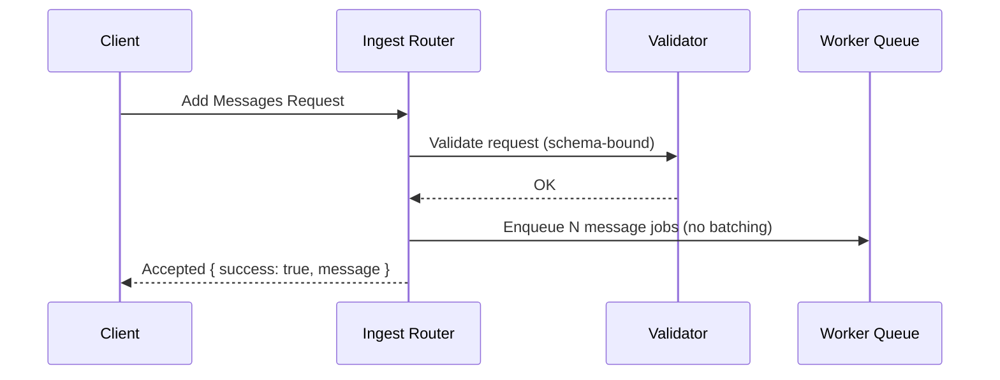
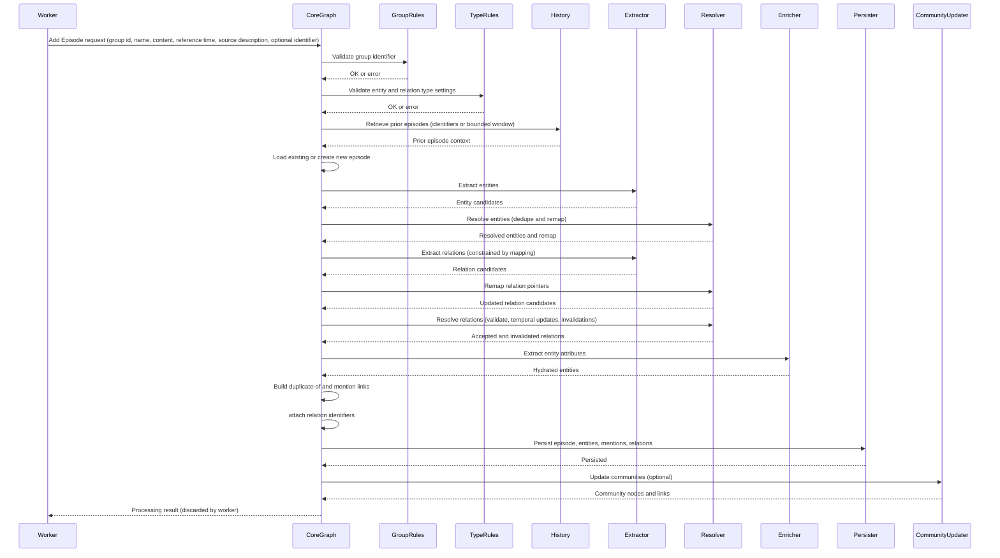
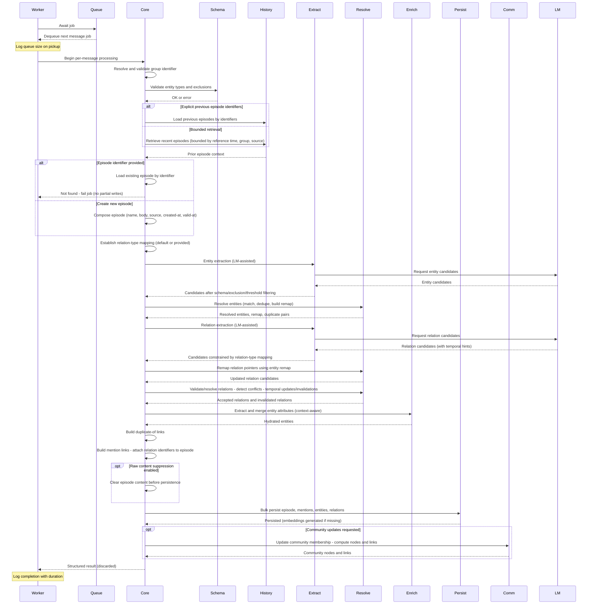
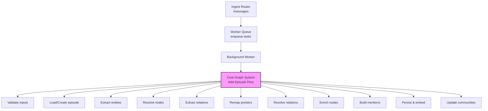

# Add Interaction (Messages) End-to-End Specification

## Overview

This document describes, in plain English and without reference to specific programming languages or technologies, how the server handles a request to add interactions (messages). It explains the complete flow starting at request receipt and ending at the server's response, and then describes the asynchronous processing path across the core graph system, including all decision points, validations, side effects, and outputs. It includes diagrams and acceptance criteria suitable for test generation.

## Terminology

| Term | Definition |
|------|------------|
| **Request** | The submission made by a client to add one or more messages to a group. |
| **Message** | A single conversational item with content, role type, optional custom role, optional name and identifier, a timestamp, and an optional source description. |
| **Group** | A logical partition identifier. All graph operations occur within the context of a group. |
| **Episode** | A time-stamped record representing the message as an input document for extraction. |
| **Entity** | A node representing an extracted real-world object or concept. |
| **Fact** | A relation between entities carrying a name and a textual statement, optionally with temporal fields. |
| **Mention** | A link from an episode to an entity indicating the entity was mentioned in that episode. |
| **Community** | An optional aggregation of entities used for clustering and summarization. |

## High-level Flow

1. Client sends a request to add messages for a given group.
2. Server validates the request format using a schema-bound request model at the boundary (shape and field types), with semantic validations delegated downstream.
3. Server enqueues one background job per message (no batching) and immediately acknowledges receipt to the client.
4. A single background worker processes enqueued message jobs sequentially in FIFO order for the router’s lifetime.
5. For each message, the core graph system creates or loads an episode, extracts entities and facts, deduplicates and resolves them, generates embeddings when needed, and writes results to the store. Community updates are not performed via the messages endpoint unless explicitly requested by a different caller.
6. Processing errors affect only the background job for that message and do not change the immediate response already sent.

## Request and Response Contract

### Input (Add Messages)

| Field | Type | Required | Description |
|-------|------|----------|-------------|
| `group_id` | string | Yes | Text identifier for the group |
| `messages` | array | Yes | List of Message objects |

#### Message Object

| Field | Type | Required | Description |
|-------|------|----------|-------------|
| `content` | string | Yes | Text of the message |
| `uuid` | string | No | Unique identifier of the episode if reusing an existing record |
| `name` | string | No | Episode name |
| `role_type` | string | Yes | One of: `user`, `assistant`, `system` |
| `role` | string | No | Custom role |
| `timestamp` | datetime | Yes | Timestamp; if not supplied, server uses current time |
| `source_description` | string | No | Text describing the origin |

### Synchronous Response

- Status: Accepted
- Body:
  - message: "Messages added to processing queue"
  - success: true

Notes:
- No job identifiers or processing results are returned.
- An empty messages list yields zero enqueued jobs and still returns Accepted with the same body.

## Server Components Involved

| Component | Description |
|-----------|-------------|
| **Ingest Router** | Receives the request, manages the background worker lifecycle, and enqueues processing tasks. |
| **Background Worker** | Maintains a queue and runs an endless loop to execute enqueued jobs sequentially. |
| **Graph Client** | A per-request instance that exposes high-level graph operations over a driver and auxiliary clients (language model, embedding generator, reranker). It is constructed from environment settings and cleaned up after request handling. |
| **Core Graph System** | The subsystem that processes episodes, entities, facts, mentions, embeddings, and optional communities. |

## Detailed Step-by-Step Processing

### A. Request Receipt and Validation

1. The server exposes an endpoint to add messages.
2. Upon receiving a request, the server validates using a schema-bound request model:
   - `group_id` is present and a string
   - `messages` is a list
   - For each message: content exists; `role_type` is one of `user`/`assistant`/`system`; timestamp is provided or defaulted by the request model; optional fields are of the correct types
3. If validation fails, the server returns an error indicating invalid input. If validation passes, proceed.
4. An empty messages list is considered valid and results in zero enqueued jobs.

### B. Enqueue and Immediate Acknowledgment

4. The server constructs one processing task per message (no batching):
   - Episode body is created as: `"{role or empty}({role_type}): {content}"`
   - Source description and timestamp are carried over (timestamp may come from the request or default to the current time at request parsing)
   - Group id and optional episode uuid and name are carried over
5. Each task is placed onto the background worker queue.
6. The server immediately returns an Accepted response, without waiting for processing to complete.

### C. Background Worker Lifecycle

7. A single background worker runs for the router's lifetime. It pulls one job at a time from the queue and executes it sequentially (FIFO).
8. On job pickup, the system logs the current size of the remaining queue.
9. On shutdown, the worker is cancelled and any remaining items in the queue are drained without execution.

### D. Per-Message Processing in the Core Graph System

For each message task, the worker calls the core graph system to add an episode. The core graph system performs the following steps:

#### Preparation

9. Resolve the group identifier:
   - If absent, a provider-specific default is applied; for the messages endpoint, a group identifier is supplied by the request.
10. Validate:
   - Group identifier format
   - Optional custom entity type definitions, if provided
   - Optional excluded entity types, if provided, must be consistent with definitions
11. Determine previous episode context:
   - If explicit previous episode identifiers are supplied, load those
   - Otherwise, retrieve a bounded number of recent episodes prior to the message’s reference time, filtered by the same group and source

#### Episode Creation or Loading

12. If an episode identifier is provided:
   - Attempt to load the episode with that identifier
   - If not found, the job fails with a not-found error
13. If no episode identifier is provided:
   - Create a new episode with: name (may be empty), group identifier, empty labels, source set to message, content set to the constructed episode body, source description, created-at set to now, valid-at set to the message reference time

#### Default Relation Type Mapping

14. Establish a default mapping for allowed relation types between generic entities:
   - If custom relation type definitions are provided: map a generic entity pair to the list of allowed relation types
   - Otherwise: use an empty list of allowed types (generic behavior)

#### Entity Extraction

15. Extract a list of entities from the episode content and relevant previous episodes, respecting provided entity type definitions and exclusions.
   - Inputs:
     - Current episode body
     - Bounded set of previous episodes (explicit or retrieved)
     - Optional entity type schema and excluded types
   - Normalization:
     - Normalize whitespace and reduce formatting artifacts
     - Canonicalize obvious aliases where appropriate (consistent casing; trimmed punctuation)
   - Candidate identification:
     - Identify spans likely representing domain-relevant concepts (as defined by the schema), such as people, organizations, places, products, events, and generic entities
     - Use local context windows to disambiguate and reduce false positives
   - Contextual reinforcement:
     - Cross-check against previous episodes to detect continuity (recurring mentions) and strengthen weak candidates
     - Prefer candidates with consistent descriptors across the recent context
   - Typing and schema constraints:
     - Assign candidate types using the schema where provided; default to a generic type for unknowns
     - Drop candidates that violate exclusions
   - Scoring and selection:
     - Compute a confidence score per candidate using signals such as contextual fit, recurrence, lexical cues, and alignment with schema
     - Keep all candidates above a conservative threshold; retain lower-confidence candidates only if reinforced by context or required for downstream relation extraction
   - Output:
     - Candidate entities with preliminary type assignments, canonical names, and stable temporary identifiers
     - Confidence scores and salient attributes inferred from the episode body (e.g., descriptors that may become attributes later)

#### Node Resolution and Relation Extraction (concurrent)

16. Resolve extracted entities against existing nodes in the graph:
   - Identify duplicates and construct a mapping from temporary identifiers to resolved identifiers
   - Output: Resolved entities, a remapping table, and duplicate pairs
17. Extract relation candidates between entities using the episode content, extracted entities, and previous episodes, constrained by the relation type mapping and group identifier.
   - Output: A list of extracted relation candidates (possibly empty)

#### Remap Relation Pointers

18. Apply the remapping table so all relations point to resolved entity identifiers.

#### Relation Resolution and Attribute Extraction (concurrent)

19. For relations:
   - Validation and consolidation:
     - Validate candidate relations against existing ones for the same pair and name
     - Merge compatible evidence and extend episode provenance where applicable
   - Temporal reasoning:
     - If a new relation conflicts with a previously valid relation for the same pair and name, close or mark invalidation of the older relation based on recency and explicit temporal cues in content
     - Assign valid-at/invalid-at based on the episode reference time and content-derived hints
   - Acceptance and invalidation:
     - Split results into accepted relations and invalidated relations, capturing reasons (e.g., superseded, contradicted)
20. For entities:
   - Attribute extraction and consolidation:
     - Derive descriptive attributes (roles, qualifiers) from the episode and context
     - Prefer attributes reinforced across multiple mentions; avoid overwriting stable attributes with low-confidence values
     - Merge newly derived attributes with the resolved entity representation using conservative update rules

#### Duplicate Links and Episode Mentions

21. Create duplicate-of links for any detected duplicate entity pairs.
22. Compose the final relation set as accepted relations + invalidated relations + duplicate-of links.
23. Create mention links from the episode to each resolved entity.
24. Attach the list of relation identifiers to the episode for provenance.

#### Optional Raw Content Suppression

25. If configured to suppress raw episode content, remove the episode content before persistence.

#### Persistence and Embeddings

26. Save the episode, mention links, resolved entities (with attributes), and relations in a single bulk persistence operation.
27. During the bulk operation, generate and store embeddings where missing:
   - For entity names
   - For relation text

#### Optional Community Updates

28. If community updates are requested:
   - For each resolved entity, update its community membership and produce community nodes and membership links as needed
   - Generate and store embeddings for community nodes
   - Save community nodes and links

#### Completion

29. Return a structured result containing the episode, mention links, resolved entities, relations, and optionally community nodes and links.
30. The background worker discards the result; the synchronous endpoint does not return it.

## Error Handling

| Error Type | When It Occurs | Impact |
|------------|----------------|---------|
| **Input Validation Errors** | Invalid request format, missing required fields, wrong data types | Returned immediately to client with validation error status |
| **Background Processing Errors** | Not found, driver errors, extraction failures, persistence failures | Individual job fails; synchronous response unaffected |
| **Telemetry Errors** | Initialization telemetry fails on core client creation | Ignored; processing continues normally |

## Diagrams

### Sequence: Synchronous Path

### Sequence: Per-Message Asynchronous Processing

### Sequence: Background Job Lifecycle

### Component Interaction Map

## Input/Output References

### Synchronous Endpoint

| Aspect | Description |
|--------|-------------|
| **Input** | Add Messages (group id, list of messages) |
| **Output** | Accepted with success and message |
| **Side Effects** | Enqueue N jobs |

### Per-Message Job into Core Graph

#### Input

| Field | Description |
|-------|-------------|
| `name` | Episode name |
| `episode body` | Role and role type prefix + content |
| `source description` | Text describing the origin |
| `reference time` | Message reference time |
| `group id` | Group identifier |
| `source type` | Set to "message" |
| `episode identifier` | Optional identifier |
| `flags and type schemas` | Optional: entity types, excluded types, relation types, relation type map, previous episode identifiers |

#### Output

| Component | Description |
|-----------|-------------|
| `episode` | The created or loaded episode |
| `mention links` | Links from episode to entities |
| `resolved entities` | Deduplicated and resolved entity nodes |
| `relations` | Including invalidations and duplicates |
| `community nodes and links` | Optional: community structures |

## Acceptance Criteria

### Routing and Worker

| # | Criteria |
|---|----------|
| 1 | Given a well-formed request with K messages, the server returns Accepted with success true and queues exactly K jobs (no batching). |
| 2 | The worker starts when the router is active and stops on router shutdown, draining queued items without executing them. |
| 3 | Jobs are processed sequentially in FIFO order. |
| 4 | A log entry indicating the remaining queue size appears when a job is picked up. |

### DTO Validation

| # | Criteria |
|---|----------|
| 5 | Missing group id yields an immediate validation failure response. |
| 6 | Role type outside the allowed set yields an immediate validation failure response. |
| 7 | Omitted timestamp is defaulted to the current time at request parsing. |
| 8 | Empty messages list is accepted and results in zero enqueued jobs and an Accepted response. |

### Episode Handling

| # | Criteria |
|---|----------|
| 9 | If a uuid is provided for an existing episode, the system loads that episode rather than creating a new one. |
| 10 | If a uuid is provided for a non-existent episode, the job fails, leaving no partial writes. |
| 11 | If no uuid is provided, a new episode is created with content `"{role or empty}({role_type}): {content}"`, created-at set to now, valid-at set to the message timestamp, and source type set to message. |
| 12 | The episode is associated with the supplied group id. |

### Group and Schema Validation

| # | Criteria |
|---|----------|
| 13 | Group id is validated; invalid group ids cause the job to fail before any writes. |
| 14 | If custom entity type schemas are provided, they are validated; inconsistencies cause the job to fail. |
| 15 | Excluded entity types are validated relative to provided schemas; inconsistent exclusions cause failure. |

### Previous Context Selection

| # | Criteria |
|---|----------|
| 16 | When explicit previous episode ids are given, those episodes are used as context. |
| 17 | Otherwise, a bounded number of the most recent episodes before the timestamp are used as context, filtered by group and source type (the exact bound is an internal constant and may change). |

### Extraction and Resolution

| # | Criteria |
|---|----------|
| 18 | Entity extraction may yield zero or more entities; zero is allowed and results in no entity nodes or relations. |
| 19 | Node resolution identifies duplicates, produces a remapping map, and yields resolved entities. |
| 20 | Relation extraction may yield zero or more relation candidates; zero is allowed. |
| 21 | Relation pointers are remapped with the node remapping map so that all relations reference resolved identifiers. |
| 22 | Relation resolution separates accepted relations and invalidated relations based on conflicts and temporal rules; both lists may be empty. |
| 23 | Entity attributes are extracted and applied to each resolved entity. |
| 24 | Duplicate-of links are created for all detected duplicate entity pairs. |
| 25 | Mention links from the episode to each resolved entity are created. |
| 26 | The episode records the list of relation identifiers for provenance. |

### Persistence and Embeddings

| # | Criteria |
|---|----------|
| 27 | All episode, mentions, entities, and relations are persisted in one bulk operation. |
| 28 | When missing, entity name embeddings are generated and stored before or during persistence. |
| 29 | When missing, relation text embeddings are generated and stored before or during persistence. |
| 30 | If configured to suppress raw content, the episode content is cleared before persistence. |

### Communities (Optional)

| # | Criteria |
|---|----------|
| 31 | When community updates are requested, community nodes and membership links are generated or updated for each resolved entity and persisted. If not requested, no community changes are made. |

### Error Behavior

| # | Criteria |
|---|----------|
| 32 | Synchronous response is unaffected by background processing errors for individual jobs. |
| 33 | If any step in per-message processing fails (not found, validation failure, extraction failure, persistence failure, embedding failure), the job fails; later jobs still run. |
| 34 | Initialization telemetry errors do not affect processing. |
| 35 | Transient language-model or client errors are retried once with backoff; persistent failures degrade gracefully by skipping the failed sub-step and continuing with available data. |
| 36 | Partial extraction is allowed; downstream steps proceed with best-effort data (entities without relations or relations without attributes do not block processing). |
| 35 | Transient language-model or client errors are retried once; persistent failures degrade gracefully by skipping the failed sub-step and continuing with available data. |
| 36 | Partial extraction (entities without relations or relations without attributes) is allowed; downstream steps proceed with best-effort data. |

### Performance and Concurrency

| # | Criteria |
|---|----------|
| 35 | Within the core graph system, selected steps may run concurrently with limits; correctness does not depend on concurrency. |
| 36 | The router's single worker ensures ordered processing; multiple requests result in interleaved but still sequential job execution. |
| 37 | Language-model-dependent stages are bounded by a concurrency limit to avoid resource contention; retries respect backoff to reduce cascading failures. |
| 37 | Language-model-dependent stages are bounded by a concurrency limit to avoid resource contention; retries respect backoff to reduce cascading failures. |

### Traceability and Logging

| # | Criteria |
|---|----------|
| 37 | The system logs a completion message for each episode processing with total duration. |
| 38 | The worker logs queue size on job pickup. |
| 39 | For LM-assisted stages, record high-level outcomes (counts of candidates, accepted/invalidated relations, retries) without logging raw content; preserve provenance via episode and relation identifiers. |
| 39 | For LM-assisted stages, log high-level outcomes (counts of candidates, accepted/invalidated relations, retries) without including raw content; preserve provenance via episode and relation identifiers. |

## Out-of-Scope Notes

- This specification does not cover retrieval APIs.
- This specification does not rely on any specific language, framework, or storage technology.
